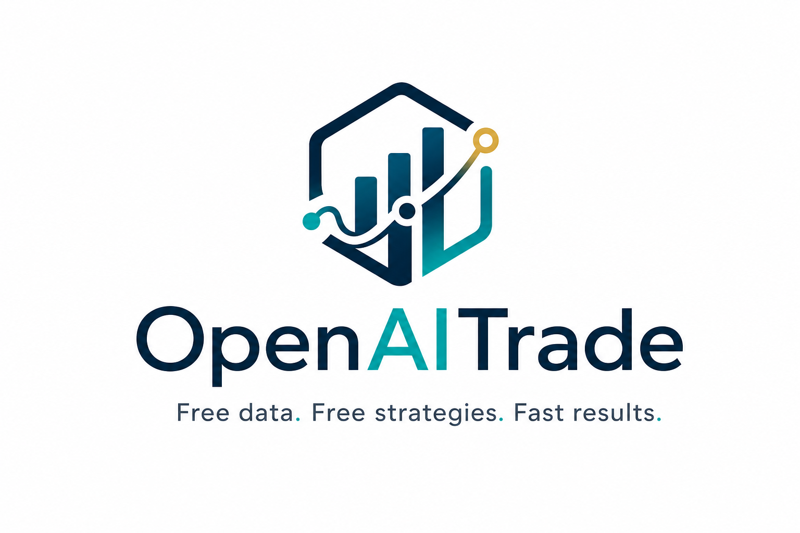
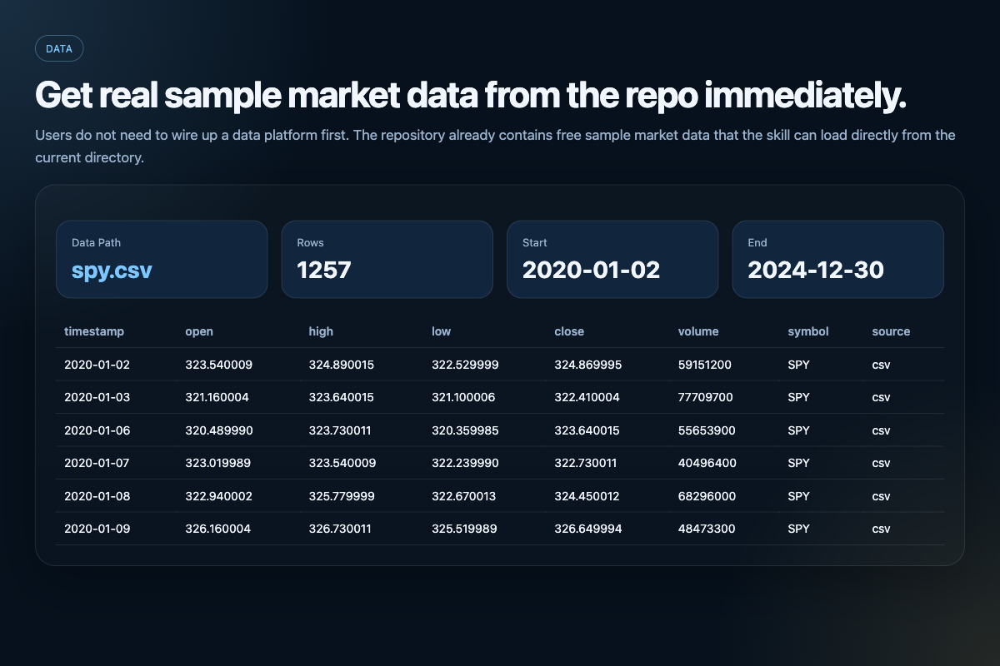
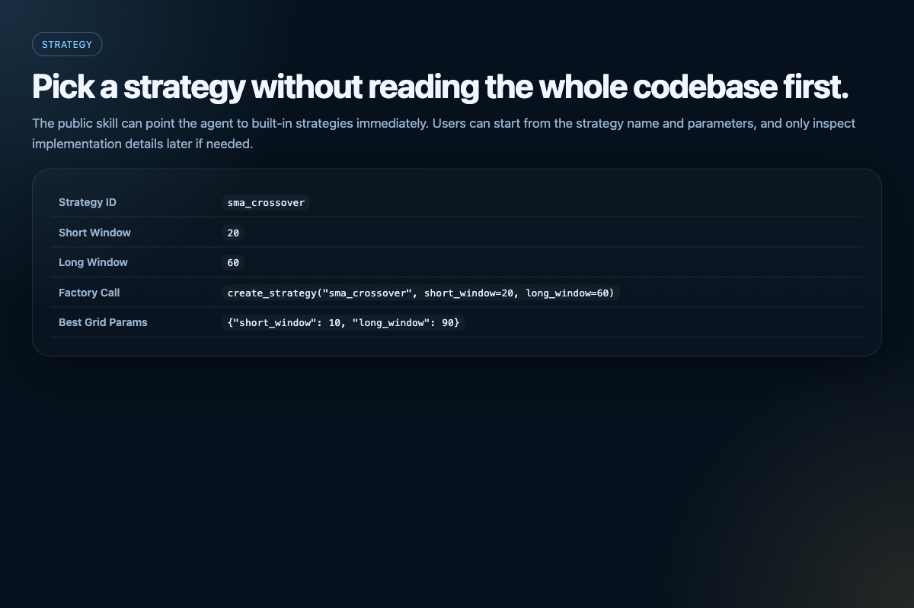
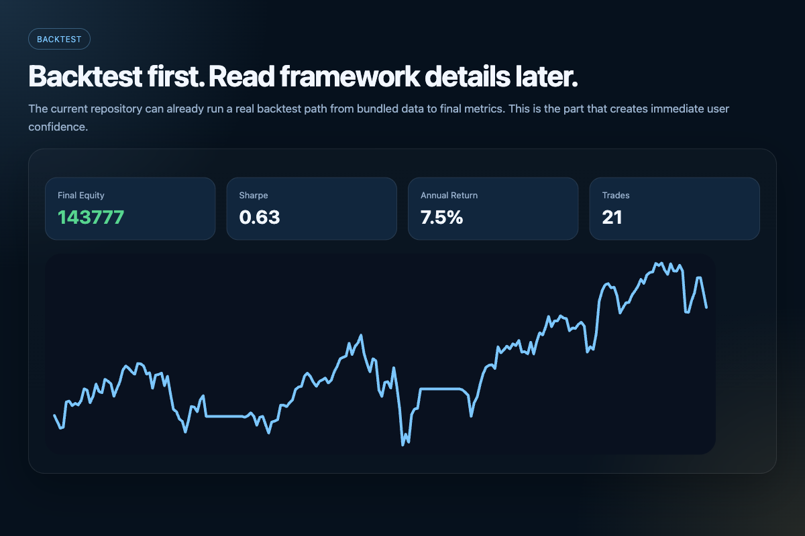
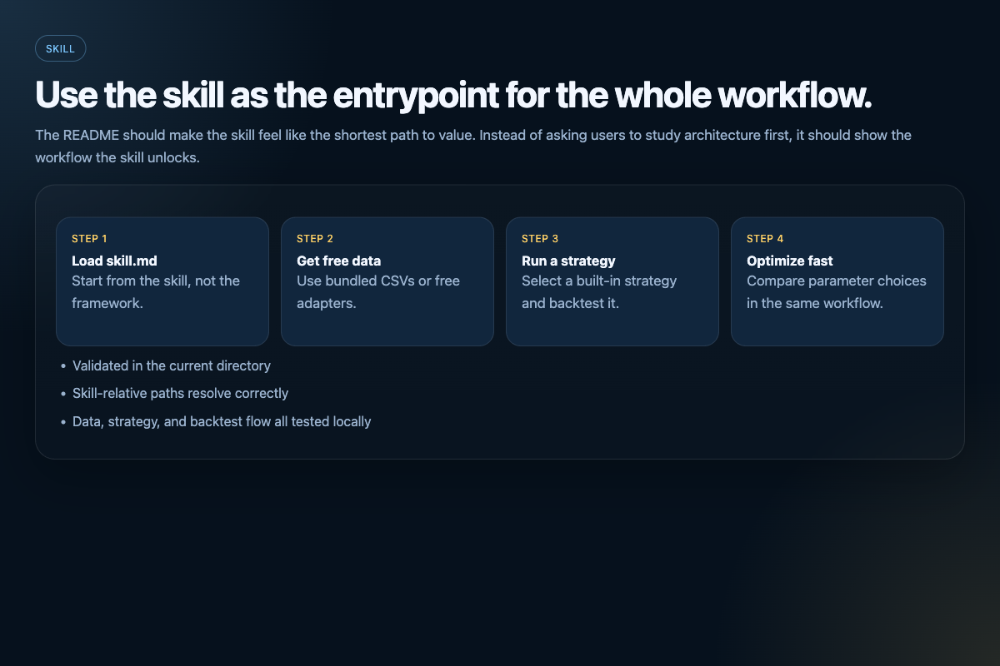

<p align="center">
  
</p>

<h1 align="center">OpenAITrade</h1>

<p align="center">
  <sub>中文版：<a href="zh/README.md">zh/README.md</a></sub>
</p>

<p align="center">
  
</p>

Start with `skill.md`. Get data, pick a strategy, run a backtest, and see results fast.

Free data. Free strategies. Free workflow.

<p align="center">
  
</p>

## For Humans

Copy and paste this to your LLM agent:

```text
You are setting up and validating the OpenAITrade repository as an agent-first quant workflow.

Working directory: the repository root.

Your goals:
1. Install the project with dev dependencies.
2. Prove that bundled market data can be loaded.
3. Prove that built-in strategies can be listed.
4. Prove that a sample backtest runs.
5. Prove that the skill flow validation passes.

Run these commands in order:

python -m venv .venv && source .venv/bin/activate && pip install -e ".[dev]"
python -c "from pathlib import Path; import pandas as pd; p=Path('data/market_data/spy.csv'); df=pd.read_csv(p); print(df.head(5).to_string(index=False))"
python -c "from openaitrade.strategies.factory import STRATEGIES; [print(f'{sid:24s} {cls.category:18s} {cls.name}') for sid, cls in STRATEGIES.items()]"
python examples/quickstart.py
python -m pytest -q tests/test_skill_installation.py

Constraints:
- Do not modify repository files unless installation or validation fails and you need to explain why.
- Prefer reporting exact command results instead of paraphrasing vaguely.

Success criteria:
- The install completes successfully.
- The data command prints rows from the bundled sample dataset.
- The strategy command prints the built-in strategy list.
- The quickstart example runs successfully.
- tests/test_skill_installation.py passes.

At the end, give a short report with:
- install status
- data status
- strategy status
- backtest status
- skill validation status
- any blocker or fix needed
```

If you want to read first, keep going. If not, let your agent do the setup and validation for you.

## For LLM Agents

Execute this workflow from the repository root.

Goals:

1. Install the project with dev dependencies.
2. Load bundled market data successfully.
3. List built-in strategies successfully.
4. Run the quickstart backtest successfully.
5. Validate the skill workflow successfully.

Run these commands in order:

```bash
python -m venv .venv && source .venv/bin/activate && pip install -e ".[dev]"
python -c "from pathlib import Path; import pandas as pd; p=Path('data/market_data/spy.csv'); df=pd.read_csv(p); print(df.head(5).to_string(index=False))"
python -c "from openaitrade.strategies.factory import STRATEGIES; [print(f'{sid:24s} {cls.category:18s} {cls.name}') for sid, cls in STRATEGIES.items()]"
python examples/quickstart.py
python -m pytest -q tests/test_skill_installation.py
```

Expected outcome:

- installation succeeds
- the data command prints sample rows
- the strategy command prints the built-in strategy list
- the quickstart example runs
- `tests/test_skill_installation.py` passes

If any step fails, report:

- which command failed
- the exact error
- whether the issue is install-related, data-related, strategy-related, backtest-related, or skill-related

## You Get

- Free bundled sample market data
- Free built-in strategies
- A backtest engine you can use immediately
- A parameter optimization workflow
- A `skill.md` entrypoint that ties the whole flow together

## What You Can See Immediately

### Get Data


Load bundled sample market data in seconds.

### Pick Strategy


Choose a built-in strategy before reading the codebase.

### See Results


Run a real backtest and inspect the result immediately.

### Start With The Skill


Use `skill.md` as the fastest path from idea to result.

## Start Here If You Want Results First

1. Load `skill.md`
2. Use bundled data or a free adapter
3. Pick a strategy
4. Run a backtest
5. Try optimization
6. Read the code only when you want more control

## Verify Fast

Validate the public package:

```bash
python -m pytest -q
```

Validate the skill flow in the current directory:

```bash
python -m pytest -q tests/test_skill_installation.py
```

The tested skill flow already covers:

- resolving skill-relative paths correctly
- loading real bundled sample data
- creating strategies through the factory
- running backtests through the backtest engine

## Use This For

- test a strategy idea quickly with an agent
- try free data and free strategies before paying for tooling
- run backtests without building infrastructure first
- package a quant workflow as a reusable skill

## Find Things

- [openaitrade/data](openaitrade/data): free data access
- [openaitrade/strategies](openaitrade/strategies): free strategies
- [openaitrade/backtest](openaitrade/backtest): backtesting
- [openaitrade/tools](openaitrade/tools): optimization
- [data/market_data](data/market_data): bundled sample data
- [strategy_packs](strategy_packs): structured workflow assets

## Go Deeper

- [skills/openaitrade/SKILL.md](skills/openaitrade/SKILL.md)
- [docs/STRATEGIES.md](docs/STRATEGIES.md)
- [docs/BACKTESTING.md](docs/BACKTESTING.md)
- [docs/LIVE_TRADING.md](docs/LIVE_TRADING.md)
