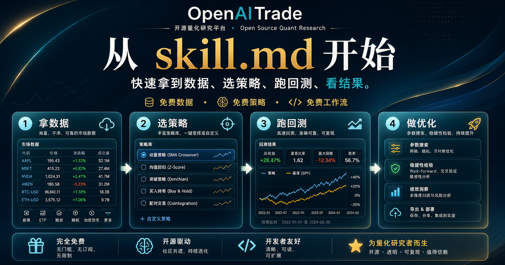

<p align="center">
  
</p>

<h1 align="center">OpenAITrade</h1>

<p align="center">
  
</p>

从 `skill.md` 开始，快速拿到数据、选策略、跑回测、看结果。

免费数据，免费策略，免费工作流。

<p align="center">
  
</p>

## 给人类用户

把下面这段直接复制给你的 LLM Agent：

```text
请把这个仓库作为一个 agent-first 的量化工作流来完成安装与验证。

工作目录：仓库根目录。

你的目标：
1. 安装项目及 dev 依赖。
2. 证明仓库内置市场数据可以被成功读取。
3. 证明内置策略可以被成功列出。
4. 证明样例回测可以成功运行。
5. 证明 skill 工作流验证可以通过。

按顺序执行下面这些命令：

python -m venv .venv && source .venv/bin/activate && pip install -e ".[dev]"
python -c "from pathlib import Path; import pandas as pd; p=Path('data/market_data/spy.csv'); df=pd.read_csv(p); print(df.head(5).to_string(index=False))"
python -c "from openaitrade.strategies.factory import STRATEGIES; [print(f'{sid:24s} {cls.category:18s} {cls.name}') for sid, cls in STRATEGIES.items()]"
python examples/quickstart.py
python -m pytest -q tests/test_skill_installation.py

约束：
- 除非安装或验证失败并且必须解释原因，否则不要修改仓库文件。
- 优先给出精确命令输出，不要只做模糊总结。

成功标准：
- 安装成功完成。
- 数据命令成功打印内置样例数据。
- 策略命令成功打印内置策略列表。
- quickstart 示例成功运行。
- tests/test_skill_installation.py 成功通过。

最后给一个简短报告，包含：
- 安装状态
- 数据状态
- 策略状态
- 回测状态
- skill 验证状态
- 是否存在阻塞或需要修复的问题
```

如果你想自己先看文档，可以继续往下读；如果不是，直接让 agent 帮你完成安装和验证。

## 给 LLM Agents

请从仓库根目录执行下面这套流程。

目标：

1. 安装项目及 dev 依赖。
2. 成功读取仓库内置市场数据。
3. 成功列出内置策略。
4. 成功运行 quickstart 回测。
5. 成功通过 skill 工作流验证。

按顺序执行下面这些命令：

```bash
python -m venv .venv && source .venv/bin/activate && pip install -e ".[dev]"
python -c "from pathlib import Path; import pandas as pd; p=Path('data/market_data/spy.csv'); df=pd.read_csv(p); print(df.head(5).to_string(index=False))"
python -c "from openaitrade.strategies.factory import STRATEGIES; [print(f'{sid:24s} {cls.category:18s} {cls.name}') for sid, cls in STRATEGIES.items()]"
python examples/quickstart.py
python -m pytest -q tests/test_skill_installation.py
```

预期结果：

- 安装成功
- 数据命令打印样例数据
- 策略命令打印内置策略列表
- quickstart 示例成功运行
- `tests/test_skill_installation.py` 成功通过

如果任一步骤失败，请报告：

- 失败的是哪条命令
- 精确报错内容
- 问题属于安装、数据、策略、回测还是 skill 验证

## 你会得到

- 仓库里自带的免费样例市场数据
- 可以直接使用的免费内置策略
- 可以马上运行的回测引擎
- 可以直接尝试的参数优化流程
- 把整套流程串起来的 `skill.md`

## 你一眼能看到什么

### 先拿数据


几秒内拿到仓库内置的真实样例数据。

### 先选策略


先选一个现成策略，再决定要不要深入读代码实现。

### 先看结果


先跑出真实回测结果，再决定要不要研究整套框架。

### 先用 Skill


把 `skill.md` 当成从想法到结果的最快路径。

## 如果你只想先跑起来

1. 加载 `skill.md`
2. 使用免费数据
3. 选择免费策略
4. 运行回测
5. 运行优化
6. 只有在你需要更强控制时，再继续读代码

## 快速验证

验证整个公开版：

```bash
python -m pytest -q
```

验证当前目录下的 skill 工作流：

```bash
python -m pytest -q tests/test_skill_installation.py
```

已经验证通过的范围：

- skill 中引用的相对路径可以正确解析
- 可以直接读取真实样例数据
- 可以通过策略工厂创建策略
- 可以通过回测引擎完成回测

## 适合这样用

- 让 agent 快速帮你验证一个策略想法
- 先用免费数据和免费策略试起来
- 不先搭基础设施就开始做回测
- 把量化研究流程沉淀成可复用的 skill

## 去哪里找

- [../openaitrade/data](../openaitrade/data)：免费数据接入
- [../openaitrade/strategies](../openaitrade/strategies)：免费策略代码
- [../openaitrade/backtest](../openaitrade/backtest)：回测引擎
- [../openaitrade/tools](../openaitrade/tools)：优化工具
- [../data/market_data](../data/market_data)：免费样例数据
- [../strategy_packs](../strategy_packs)：结构化策略工作流资产

## 继续深入

- [skills/openaitrade/SKILL.md](skills/openaitrade/SKILL.md)
- [docs/STRATEGIES.md](docs/STRATEGIES.md)
- [docs/BACKTESTING.md](docs/BACKTESTING.md)
- [docs/LIVE_TRADING.md](docs/LIVE_TRADING.md)
